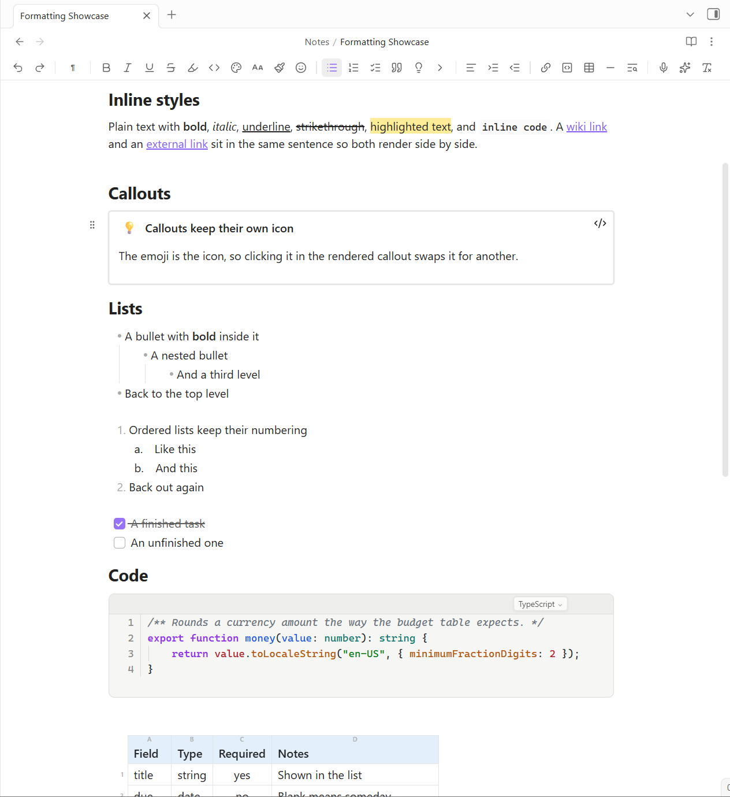

# Power Editor

Format any note from a toolbar, the way you would in Word or Notion. Your notes stay plain Markdown, so nothing is locked in and every other plugin keeps working.

## What you get

- **A toolbar** above every note: styles, bold, colors, lists, callouts, tables, links, and more. Buttons light up to show what the cursor is sitting in. Choose which ones you want in settings.
- **A selection bubble.** Select text and the common options appear right there, so your hand never travels to the top of the pane.
- **Slash commands.** Type `/` for headings, lists, callouts, tables, and the rest.
- **Clean text on screen.** Bold looks bold and highlights are painted, without `**` or `==` cluttering the line. The markers are still in the file, you just stop seeing them.
- **Drag handles on every block.** Grab the grip in the margin to move a paragraph, list, table, or a whole heading section. Click it for a menu: turn into something else, duplicate, copy a link to it, or delete.

Every toolbar action is also a command, so anything can have a keyboard shortcut.

## Callouts

One button turns the block under your cursor into a colored, titled box: tip, note, info, success, question, warning, danger, example, or quote. The emoji at the front is clickable, so you can swap it for any other.

If your older notes start lines with `**Tip:**` or `**Note:**`, three commands upgrade them into real callouts, either one note at a time or across the whole vault with a preview first. Nothing is written until you press Convert.

## Toggle blocks

Fold anything behind its first line, Notion-style. The first line stays visible and the rest collapses under a chevron. It is an ordinary collapsible callout underneath, so it still folds on mobile, in Reading view, and after publishing.

## Copy that survives email

Copying Markdown into Outlook or Gmail usually arrives mangled: numbered lists renumber themselves and formatting goes missing. Power Editor puts real HTML on the clipboard instead, so what you paste looks like what you copied.

Pasting the other way is cleaned up too. Text from Word, the web, or a chat with an AI arrives as tidy Markdown with the junk stripped out, and tables rebuild as real tables instead of one run-on paragraph.

Pasting back into Obsidian gives you your original Markdown, not a reading of the HTML.

## Images and tables

Click an image for a floating toolbar: align it, size it, add a caption, swap it, or remove it. Or hover it and drag the corner to resize, with the width written into the note so it holds on every device.

The table button opens a Word-style grid. Sweep to the size you want and click. Drag a column edge in the header to set its width. [Power Tables](https://github.com/obsidian-power-plugins/obsidian-power-tables) takes over from here if you want sorting, filters, colors, and totals.

## Last edited, on the page

A quiet "Edited 3 minutes ago" line, under the title or at the end of the note, your choice. Obsidian already tracks this for every file and simply never shows it to you.

In a synced vault the file's own timestamp can lie, because sync rewrites it when a note arrives from another device. So a note's `updated:` property wins wherever you have one.

## Dictate

Click the mic, talk, click again, and your words land at the cursor. Point it at any OpenAI-compatible transcription service in settings, including a Whisper server on your own machine, which needs no key. Choose whether it lands as a raw transcript, tidied prose, or bullet points.

## Format painter

Select formatted text, click the paintbrush, then select the text to paint. Click once to paint the next selection, twice to keep painting until you stop, and Escape to let go.

Copying unformatted text works too. The brush then holds "no formatting", which is the quickest way to strip stray bold and colors out of a note.

## AI edits

The sparkle menu rewrites the selection in place: improve writing, fix grammar, make shorter, summarize, plus any custom actions you add yourself. Two more need no selection: continue writing, and summarize the page into bullets.

Uses your own Anthropic key. The default model costs pennies.

## Settings

Toolbar on or off (separately on mobile), which buttons appear, the selection bubble, block handles, clean paste, line spacing, dictation, keys and models for AI, and your own AI actions.

Two spacing settings deserve a mention. Markdown needs a blank line under every heading and on both sides of every table, and in editing view each of those takes up a full line. **Space under headings** and **Space around tables** shrink exactly those gaps and nothing else. The file is untouched, so the Markdown still works everywhere.

## Privacy and network use

Power Editor goes online **only for the two features that need it**, using your own keys, stored locally in your vault. No telemetry, no analytics.

- **AI edits**: your selected text and your instruction go to the Anthropic API. No key means nothing is sent.
- **Dictation**: the audio clip goes to the transcription service you chose, which can be a server on your own machine. Tidied and bullet modes then send the text to the Anthropic API.

Everything else, which is to say all the formatting, blocks, links, images, tables, and paste cleanup, happens on your device.

### What the catalog's scan reports

The community catalog scans a plugin for what it is *capable* of, which is not the same as what it does with it. Power Editor reports two things.

| What the scan reports | What it is | Where |
| --- | --- | --- |
| **Vault enumeration** | Listing your notes, for the things that have to offer you one: the image picker, the link dialog, and the note pickers behind the block and template actions. Only paths and extensions are looked at, and the list stays inside Obsidian. | [`src/main.ts`](src/main.ts), the picker and suggestion builders |
| **Clipboard access** | **Reading:** two commands you run yourself, *Paste as clean Markdown* and *Insert clipboard formats*. **Writing:** *Copy as rich text*, and the copy cleanup below. Nothing reads the clipboard on its own, on a timer, or in the background. | [`src/main.ts`](src/main.ts) `clipboardHtml`, `onCopyOut` |

**One behavior worth stating plainly:** Power Editor listens for your own copy and cut, and when the selection contains formatting it rewrites the plain-text flavor, so highlighted or colored text does not paste its raw `<mark>` and `` source into other apps. It only acts in the editor, only with a selection, and only when cleaning would change something. Set **Copy mode** to off and it never fires.

There is no `eval`, no `Function` constructor, no code fetched and run at runtime, and no processes started. Network calls go through Obsidian's `requestUrl`. Two `fetch` calls appear in the built `main.js`: they belong to the bundled `@anthropic-ai/sdk`, and run only when you have an AI key set and use an AI edit.

## More Power Plugins

Each one works on its own, and they fit together when you have more than one.

- **[Power Assistant](https://github.com/obsidian-power-plugins/obsidian-power-assistant)**: record and summarize meetings, capture anything from a link, and ask your notes questions.
- **[Power Bases](https://github.com/obsidian-power-plugins/obsidian-power-bases)**: board, calendar, timeline, chart, and gallery views for Bases.
- **[Power Connect](https://github.com/obsidian-power-plugins/obsidian-power-connect)**: sync your vault through your own Dropbox, OneDrive, or Google Drive.
- **[Power Desk](https://github.com/obsidian-power-plugins/obsidian-power-desk)**: your calendars and your mail, inside your vault.
- **[Power Explorer](https://github.com/obsidian-power-plugins/obsidian-power-explorer)**: arrange files by hand, and search a huge vault instantly.
- **[Power Extract](https://github.com/obsidian-power-plugins/power-extract)**: reads the text inside images so you can search it.
- **[Power Tables](https://github.com/obsidian-power-plugins/obsidian-power-tables)**: colors, live formulas, and sorting for Markdown tables.

## Support

Power Editor is built and maintained by one person. If it earns a place in your daily vault, you can [buy me a coffee](https://buymeacoffee.com/powerplugins). Nothing in the plugin is held back either way.

